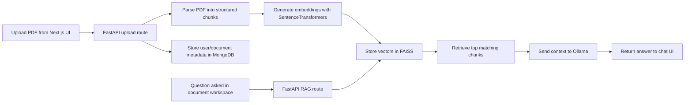

# GovPolicy Explainer

GovPolicy Explainer is a full-stack RAG application for exploring government policy PDFs through a chat-style interface. Users can upload policy documents, index them for retrieval, and ask grounded questions against a specific document instead of manually scanning long PDFs.

It combines a Next.js frontend, a FastAPI backend, MongoDB for metadata, FAISS for semantic retrieval, and Ollama for local LLM inference.

## Demo

<video src="./docs/demo/govPolicy.mp4" controls width="100%"></video>

If the embedded player does not render in your GitHub view, open the demo directly here: [govPolicy.mp4](./docs/demo/govPolicy.mp4)

## Why I Built It

Government policy documents are often:

- long and difficult to skim
- inconsistent in structure
- sometimes scanned instead of text-native
- better understood through targeted questions than manual reading

This project turns that workflow into:

1. upload a document
2. parse and index it
3. ask natural-language questions
4. inspect the most relevant supporting passages

## What The App Does

- user registration and login with JWT-based authentication
- PDF upload and per-user document management
- parsing of headings, paragraphs, and tables
- OCR fallback for scanned pages
- semantic indexing with SentenceTransformers + FAISS
- document-specific question answering through Ollama
- chat-style frontend for asking questions about a selected document
- storage of user and document metadata in MongoDB

## Tech Stack

| Layer | Tech | Why it is used |
| --- | --- | --- |
| Frontend | Next.js 14, React, TypeScript | Builds the dashboard, document workspace, and chat-style Q&A UI |
| Styling | Tailwind CSS | Fast UI composition and consistent component styling |
| API Client | Axios | Handles frontend-to-backend API requests and auth headers |
| Backend API | FastAPI | Exposes auth, upload, document, and RAG endpoints |
| Authentication | JWT, Passlib | Handles login and protects document routes |
| Database | MongoDB | Stores users and uploaded document metadata |
| Retrieval | SentenceTransformers, FAISS | Creates embeddings and performs semantic similarity search |
| LLM | Ollama (`phi3:mini`) | Generates grounded answers from retrieved policy chunks |
| Document Parsing | PyMuPDF, pdfplumber | Extracts text structure, headings, and tables from PDFs |
| OCR | pytesseract, Tesseract OCR | Handles scanned or image-based PDF pages |

## How It Works



## Current User Flow

1. Create an account or log in
2. Upload a policy PDF
3. Open the document workspace
4. Ask questions about that specific document
5. Review grounded answers and supporting passages
6. Manage or delete uploaded documents

## Project Structure

```text
backend/
  main.py                  FastAPI app entrypoint
  core/                    auth, JWT, Mongo config
  repositories/            MongoDB data access
  routes/                  auth, upload, document, and RAG routes
  services/                parser, retriever, and RAG orchestration
  scripts/                 PDF parsing, FAISS, and CLI helpers
  data/                    raw uploads and generated outputs

frontend/
  app/                     Next.js routes
  components/              auth, dashboard, document, and UI components
  lib/                     API client and auth helpers
  hooks/                   frontend state hooks
  types/                   shared TypeScript API types

docs/demo/
  govPolicy.mp4            demo video used in this README
```

## Local Setup

### Prerequisites

- Python 3.10+
- Node.js 18+
- MongoDB
- Ollama
- Tesseract OCR

The OCR path uses `eng+hin`, so install Hindi language data in Tesseract if you want Hindi OCR support.

### 1. Configure MongoDB

Create a `.env` file in the project root:

```env
MONGODB_URL=mongodb://localhost:27017
DATABASE_NAME=govpolicy_explainer
```

### 2. Start the backend

Install backend dependencies:

```bash
cd backend
python3 -m venv .venv
source .venv/bin/activate
pip install -r requirements.txt
pip install python-multipart python-jose passlib[argon2] Pillow
cd ..
```

Pull the Ollama model:

```bash
ollama pull phi3:mini
```

Run the backend from the repository root while using the backend virtual environment:

```bash
cd backend
source .venv/bin/activate
cd ..
uvicorn backend.main:app --reload
```

Backend URLs:

- API root: `http://localhost:8000/`
- Swagger docs: `http://localhost:8000/docs`

### 3. Start the frontend

```bash
cd frontend
npm install
cp .env.local.example .env.local
npm run dev
```

The example frontend environment file points to the local backend:

```env
NEXT_PUBLIC_API_BASE_URL=http://localhost:8000
```

Frontend URL:

- App: `http://localhost:3000`

## Key Backend Endpoints

- `POST /api/auth/register`
- `POST /api/auth/login`
- `POST /api/rag/upload`
- `POST /api/rag/query`
- `POST /api/rag/search`
- `GET /api/documents/documents`
- `GET /api/documents/documents/{doc_id}`
- `DELETE /api/documents/documents/{doc_id}`

## Implementation Notes

- Uploaded PDFs are processed into per-user, per-document output folders under `backend/data/outputs/{user_id}/{doc_id}/`
- Original uploaded PDF files are deleted after successful parsing and indexing
- MongoDB stores user accounts and document metadata
- The frontend document workspace sends document-specific RAG requests using the selected document context

## Why This Is Resume-Worthy

This project demonstrates:

- full-stack product development with a modern frontend and Python backend
- applied Retrieval-Augmented Generation, not just a generic chatbot wrapper
- document parsing and OCR for messy real-world inputs
- vector search and LLM orchestration
- API design, auth, file uploads, and database integration
- UX thinking through a document-focused Q&A workflow

## Demo Asset

The demo video included in this repository is located at [docs/demo/govPolicy.mp4](./docs/demo/govPolicy.mp4).
